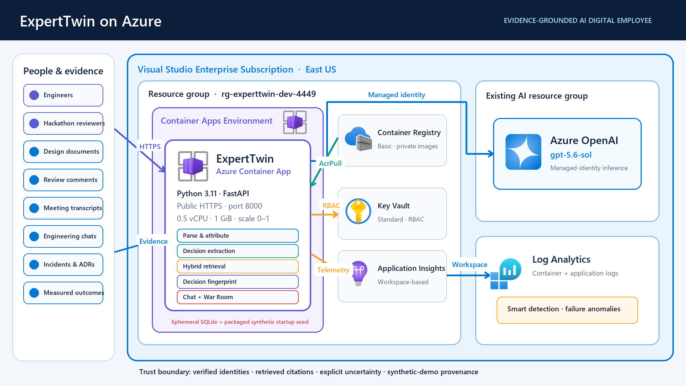
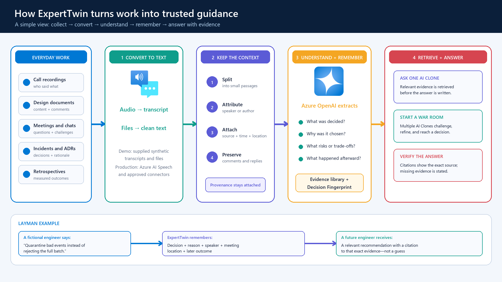
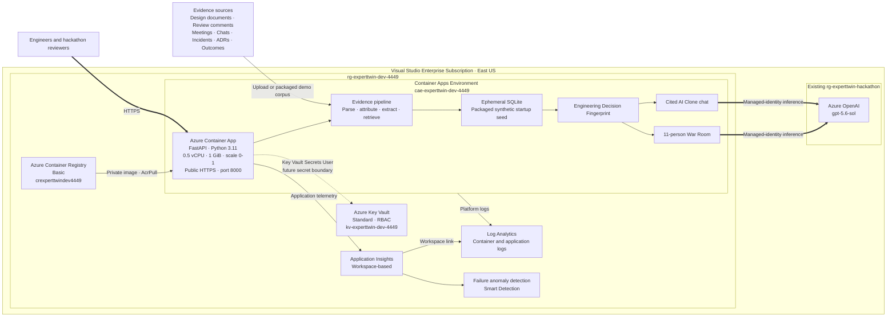

# ExpertTwin Azure Architecture

**Resource group:** `rg-experttwin-dev-4449`  
**Subscription:** Visual Studio Enterprise Subscription  
**Primary region:** East US  
**Public endpoint:** https://ca-experttwin-dev-4449.yellowsmoke-599c7db8.eastus.azurecontainerapps.io

## Summary

ExpertTwin is a public hackathon application that creates evidence-grounded AI Clones of engineering employees. It converts synthetic design reviews, technical discussions, meeting transcripts, incidents, architecture decisions, and measured outcomes into attributable decision records and an Engineering Decision Fingerprint. Users can ask one AI Clone for cited guidance or convene an 11-person War Room that captures challenges, dissent, risks, mitigations, actions, and a manager-owned final decision.

The application runs as one Python FastAPI container on Azure Container Apps Consumption. It scales from zero to one replica and uses a system-assigned managed identity to pull its image from Azure Container Registry and invoke the existing Azure OpenAI deployment. Application Insights and Log Analytics provide observability. SQLite and uploaded files remain ephemeral for the hackathon; the packaged synthetic corpus reseeds on startup.

## Resource Inventory

| Resource | Type | Region | Key configuration |
|---|---|---:|---|
| `ca-experttwin-dev-4449` | Azure Container App | East US | Public HTTPS, port 8000, 0.5 vCPU, 1 GiB, 0-1 replicas, system-assigned identity |
| `cae-experttwin-dev-4449` | Container Apps Environment | East US | Consumption environment linked to Log Analytics |
| `crexperttwindev4449` | Azure Container Registry | East US | Basic SKU; private ExpertTwin images |
| `kv-experttwin-dev-4449` | Azure Key Vault | East US | Standard SKU, RBAC authorization; no Azure OpenAI key stored |
| `appi-experttwin-dev-4449` | Application Insights | East US | Workspace-based application telemetry |
| `log-experttwin-dev-4449` | Log Analytics workspace | East US | Container and application diagnostics |
| `Application Insights Smart Detection` | Azure Monitor action group | Global | Automatically created smart-detection notification group |
| `Failure Anomalies - appi-experttwin-dev-4449` | Smart detector alert rule | Global | Automatically created failure anomaly detection |
| `experttwin-hackathon-2026` | Existing Azure OpenAI account | East US | External resource group; `gpt-5.6-sol` deployment |

## Architecture Diagram

## Layman Data-Ingestion Flow

Everyday work enters the system as recordings, documents, review comments, meeting transcripts, engineering chats, incidents, ADRs, and retrospectives. Audio is converted to a transcript, while files are converted to clean text. The current demonstration uses supplied synthetic transcripts and files; a production implementation can add Azure AI Speech and approved enterprise connectors.

ExpertTwin keeps the speaker or author, source, timestamp, document location, and discussion thread attached to each passage. Azure OpenAI then extracts decisions, rationale, alternatives, risks, trade-offs, and observed outcomes. These records form the evidence library and Engineering Decision Fingerprint. When a user asks a question or starts a War Room, relevant evidence is retrieved first, and the generated response includes citations or states that evidence is missing.

## Key Relationships and Data Flow

1. **Evidence ingestion:** Synthetic or uploaded sources enter the FastAPI application. Parsers preserve source, segment, author, role, comment thread, timestamp, confidence, and simulation provenance.
2. **Decision intelligence:** Azure OpenAI extracts structured decisions when configured. ExpertTwin stores attributable decision records in local SQLite and derives recurring engineering patterns.
3. **Individual guidance:** Hybrid retrieval selects relevant decisions for one AI Clone. The answer distinguishes expert-attributed evidence, contextual evidence, inference, and uncertainty.
4. **War Room:** The application retrieves bounded evidence for all 11 authorized AI Clones and requests one structured Azure OpenAI deliberation. Server-side validation restricts identities and citations to the trusted roster and retrieved evidence.
5. **Identity and security:** The Container App system identity has `AcrPull`, `Key Vault Secrets User`, and `Cognitive Services OpenAI User`. No Azure OpenAI API key is stored in the image or infrastructure parameters.
6. **Observability:** Application Insights sends workspace-based telemetry to Log Analytics. Container Apps platform logs use the same workspace, and Azure Monitor provides failure anomaly detection.

## Current Design Decisions

- **Container Apps Consumption:** Chosen for a low-traffic hackathon workload with scale-to-zero and a one-replica ceiling.
- **Managed identity:** Removes the need to store an Azure OpenAI API key.
- **Bounded evidence:** Limits each War Room participant to the most relevant retrieved decisions and verifies citations before returning a result.
- **Ephemeral SQLite:** Accepted for the demonstration because the packaged synthetic corpus is recreated on startup.
- **Public ingress:** Accepted for the time-boxed hackathon only; the URL should not be broadly distributed.

## Production Recommendations

- Add Microsoft Entra authentication and role-based access to experts, sources, and War Rooms.
- Move uploaded evidence and durable state to Azure Blob Storage and a managed database.
- Add Azure AI Search when corpus size requires scalable hybrid and vector retrieval.
- Add enterprise connectors for SharePoint, Azure DevOps, Teams transcripts, and approved incident systems.
- Introduce consent, retention, deletion, evaluation, and human-approval policies before using real employee data.
- Lock Python dependencies and add CI/CD with immutable image tags and automated post-deployment checks.

## Icon Source

The rendered diagram and presentation use the official Microsoft Azure Architecture Icons, used according to the guidance at https://learn.microsoft.com/azure/architecture/icons/.
